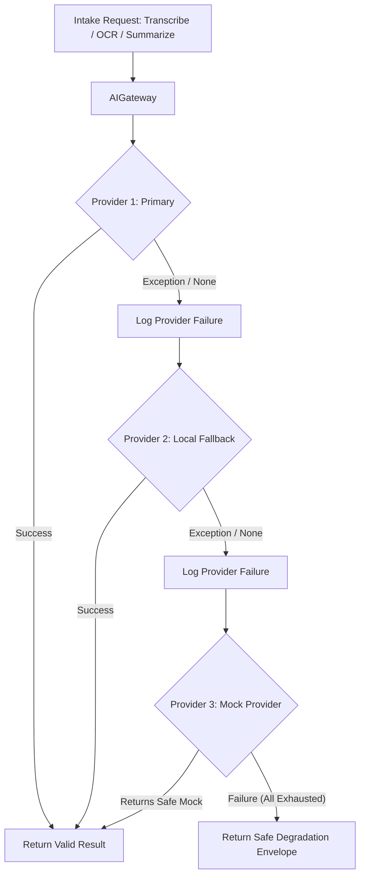

# AI Gateway & Integration Architecture — Med-Drishti

**Module:** AI Gateway & Clinical Intelligence
**File Reference:** `backend/app/ai_gateway.py`, `backend/app/ai_providers.py`
**Status:** Multi-Provider with Local & Mock Capabilities; Bhashini Adapter-Ready

---

## 1. Overview & Architectural Philosophy

In clinical healthcare systems, relying directly on proprietary or external cloud AI APIs creates critical risks: network latencies, unexpected provider outages, privacy leaks, and catastrophic runtime failures.

Med-Drishti implements an **AI Gateway Abstraction Layer** based on the Strategy and Chain-of-Responsibility design patterns. The application layer (controllers, clinical services) interacts exclusively with the `AIGateway`. Underneath, the gateway iterates across a chain of registered `AIProvider` implementations. If a primary provider experiences an exception, times out, or fails to initialize, the gateway catches the error, logs telemetry, and transparently cascades to the next registered provider.

> **Key Rule:** The frontend and core business logic never call an external AI API directly. All AI interactions pass through the internal AI Gateway.

---

## 2. Gateway Interface (`AIProvider` ABC)

All AI components implement the unified abstract base class:

```python
class AIProvider(ABC):
    @property
    @abstractmethod
    def provider_name(self) -> str:
        pass

    # Speech-to-Text (ASR)
    def transcribe(self, audio_bytes: bytes, language_hint: Optional[str] = None) -> Optional[Dict[str, Any]]:
        return None

    # Text-to-Speech (TTS)
    def synthesize(self, text: str, lang: str = "en") -> Optional[bytes]:
        return None

    # Machine Translation (NMT)
    def translate(self, text: str, source_lang: str, target_lang: str) -> Optional[str]:
        return None

    # Document OCR
    def extract_text(self, file_path: str) -> Optional[str]:
        return None

    # Clinical Named Entity Recognition (NER)
    def extract_entities(self, text: str) -> Optional[List[Dict[str, Any]]]:
        return None

    # Clinical Summarization
    def summarize(self, data: Dict[str, Any]) -> Optional[Dict[str, Any]]:
        return None
```

---

## 3. Registered Providers & Capabilities

### 3.1 `LocalVoiceProvider`
- **Speech Recognition (ASR):** Utilizes `faster-whisper` (CTranslate2-optimized Whisper models) for offline speech transcription across Indian languages (Hindi, Bengali, Tamil, Telugu, English).
- **Speech Synthesis (TTS):** Generates native MP3 audio streams using `gTTS` (Google Text-to-Speech) with target language code mapping.
- **Failover Behavior:** Returns `None` on dependency or execution failure to let the gateway cascade to the next provider.

### 3.2 `LocalOCRProvider`
- **Text Extraction:** Utilizes `pytesseract` (Google Tesseract engine) for high-contrast printed prescriptions and `easyocr` (deep learning OCR) for multilingual and handwritten text snippets.
- **Entity Extraction:** Parses medication names, dosages (mg, ml, BD, TDS), blood pressure, and lab values using regex and heuristic grammar rules.

### 3.3 `LocalSummaryProvider`
- **Clinical Synthesizer:** Deterministically combines patient demographics, subjective conversation notes, extracted OCR entities, and red-flag alerts into a structured physician-ready clinical summary format.

### 3.4 `MockAIProvider`
- **Role:** Fallback and offline evaluation provider.
- **Transcribe:** Returns synthetic transcription text with confidence `0.5`.
- **Synthesize:** Returns dummy audio bytes (`b"MOCK_AUDIO_DATA"`).
- **Extract Text:** Returns standard synthetic OCR text.
- **Summarize:** Emits a deterministic mock clinical case summary.
- **Guarantee:** Ensures that developer environments, CI pipelines, and unit tests run completely without local GPU or external credentials.

---

## 4. Gateway Cascading & Fallback Strategy

The following diagram illustrates the resilient fallback pipeline:



### Safe Degradation Envelopes
If every registered provider fails, the gateway returns a safe default envelope rather than raising an unhandled 500 error:
- **ASR:** `{"text": "[Transcription Unavailable]", "language_detected": "en", "confidence": 0.0}`
- **OCR:** `"[OCR Text Unavailable]"`
- **NER:** `[]`
- **TTS:** Falls back to browser client-side Web Speech synthesis.

---

## 5. Client-Side Multimodal Voice Integration

In addition to backend voice processing, the Next.js frontend implements browser-native speech integration:
1. **ASR (Speech-to-Text):** The kiosk interface uses the browser's native `webkitSpeechRecognition` / `SpeechRecognition` API. This delivers zero-latency transcription directly in the patient's browser without sending large streaming audio payloads over the network.
2. **TTS (Text-to-Speech):** The kiosk interface uses `window.speechSynthesis` with matching language locales (e.g. `hi-IN`, `bn-IN`, `ta-IN`) to read out intake questions to illiterate or visually impaired patients.

If the patient's browser does not support the Web Speech API (e.g., specific kiosk browsers), the interface automatically shifts to:
- Recording audio clips via `MediaRecorder` and sending them to `POST /api/v1/voice/transcribe`.
- Playing audio streams fetched from `GET /api/v1/voice/synthesize`.

---

## 6. Clinical Red-Flag Rule Engine

Red flags are evaluated through a deterministic, transparent rule engine (`red_flag_engine.py`) rather than a non-deterministic black-box LLM:

- **Rules Configuration:** Defined in `backend/app/red_flags_rules.json`.
- **Coverage:**
  - `RF_CARDIAC_URGENT` / `RF_CARDIAC_CHEST_PAIN`: Chest pain, angina, radiating pain, breathlessness.
  - `RF_NEURO_STROKE`: Slurred speech, facial droop, sudden unilateral weakness.
  - `RF_RESP_SEVERE`: Severe shortness of breath, stridor, cyanosis.
  - `RF_SEPSIS`: High fever with confusion, hypothermia, severe hypotension.
- **Severity Ranking:** `CRITICAL` > `HIGH` > `MEDIUM` > `LOW`.
- **Immediate Action:** When triggered, a record is added to `red_flags`, automatically prioritizing the patient to the top of the doctor queue and sounding alerts on the triage dashboard.

---

## 7. Bhashini National Language Mission Status

Med-Drishti is designed for seamless integration with the Government of India's **Bhashini (National Language Translation Mission)** ecosystem:

- **Status:** **Adapter-Ready (Not Connected)**.
- **Readiness:** The `AIProvider` base class matches Bhashini's ASR, TTS, and NMT pipeline specifications.
- **Connection Blueprint:** See [BHASHINI_INTEGRATION.md](./BHASHINI_INTEGRATION.md) for instructions on registering a `BhashiniProvider` once sandbox API credentials are provided.
