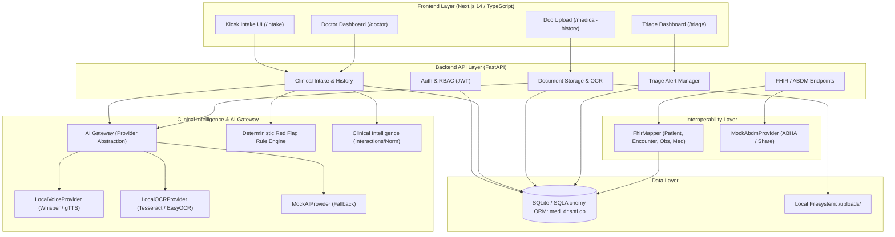

# System Architecture — Med-Drishti

**Project:** Med-Drishti
**Problem Statement:** SIH26047 — AI-Assisted Patient Case-Taking Software
**Organization:** Ministry of Ayush / All India Institute of Ayurveda
**Architecture Version:** 1.0.0
**Status:** Implemented (Local Development / Evaluation Prototype)

---

## 1. Architectural Overview

Med-Drishti is a modular, AI-assisted clinical intake platform designed to streamline outpatient department (OPD) case-taking. The platform enables patients to record clinical history via voice and touch interfaces, upload physical documents (prescriptions, laboratory reports, discharge summaries) for optical character recognition (OCR), detect clinical red flags in real-time, generate physician-ready clinical summaries, and export structured clinical records to HL7 FHIR R4 and ABDM (Ayushman Bharat Digital Mission) formats.

### Core Architectural Principle

> **AI assists clinical information capture and structuring; it does NOT make autonomous diagnostic or prescriptive decisions.**

All clinical data processed by AI modules (speech-to-text, OCR entity extraction, symptom extraction) is explicitly tagged with confidence scores and marked as unverified until reviewed, edited, and signed off by a licensed healthcare professional (Doctor).

---

## 2. Architecture Diagram

The system follows a layered, decoupled service architecture:

```text
                         +-----------------------------+
                         |      PATIENT KIOSK / UI     |
                         |   (Next.js 14 App Router)   |
                         +--------------+--------------+
                                        |
                                        | HTTP / REST (JSON & Multipart)
                                        v
                         +-----------------------------+
                         |     API GATEWAY / BACKEND   |
                         |      FastAPI + Python       |
                         |  (Auth, RBAC, Validation)   |
                         +--------------+--------------+
                                        |
        +-------------------------------+-------------------------------+
        |                               |                               |
        v                               v                               v
+------------------+          +------------------+            +------------------+
|  Patient Service |          | Clinical Service |            | Document Service |
| (Auth, Register, |          | (Sessions, HPI,  |            | (Uploads, OCR,   |
|     Consent)     |          |  Triage Alerts)  |            | Entity Tagging)  |
+--------+---------+          +--------+---------+            +--------+---------+
         |                             |                               |
         +-----------------------------+-------------------------------+
                                        |
                                        v
                         +-----------------------------+
                         |   STRUCTURED CLINICAL CASE  |
                         |  (Canonical Database Model) |
                         +--------------+--------------+
                                        |
               +------------------------+------------------------+
               |                        |                        |
               v                        v                        v
    +--------------------+    +--------------------+   +--------------------+
    |     AI GATEWAY     |    |  RULE & CLINICAL   |   |   INTEROPERABILITY |
    | (Provider Abstr.)  |    |    INTELLIGENCE    |   |     (FHIR / ABDM)  |
    +---------+----------+    +---------+----------+   +---------+----------+
              |                         |                        |
     +--------+--------+        +-------+-------+       +--------+--------+
     |        |        |        |               |       |                 |
     v        v        v        v               v       v                 v
LocalVoice LocalOCR MockAI  Red Flag Engine   Drug/Lab FhirMapper    MockAbdm
(Whisper)  (Tesseract)      (Regex & Rules)   Checks  (FHIR R4)      Provider
```

### Component Flow (Mermaid Diagram)



---

## 3. Technology Stack

| Layer | Component | Technology / Library | Role |
|---|---|---|---|
| **Frontend** | Application Framework | **Next.js 14** (App Router) | Server-rendered & client-side React 18 UI |
| | Language | **TypeScript 5** | Strict type safety across client models |
| | Styling | **Tailwind CSS 3** | Responsive kiosk & physician dashboard styling |
| | Form Handling | **React Hook Form + Zod** | Schema validation on intake forms |
| | Audio/Speech | **Web Speech API / MediaRecorder** | Browser-level ASR/TTS with backend fallback |
| **Backend** | API Framework | **FastAPI 0.100+** | High-performance asynchronous REST API |
| | Language | **Python 3.10+** | Core business logic, OCR, NLP processing |
| | ORM | **SQLAlchemy** | Object Relational Mapping and declarative models |
| | Authentication | **python-jose (JWT) + Passlib (bcrypt)** | Token-based auth and secure password hashing |
| | Server | **Uvicorn** | ASGI web server implementation |
| **Database** | Primary Database | **SQLite (`med_drishti.db`)** | Local single-file relational database |
| **Storage** | File Storage | **Local Filesystem (`/uploads/`)** | Local persistence for medical records & scans |
| **Interoperability**| Healthcare Standard | **HL7 FHIR R4 Bundle** | Export standard for Patient, Encounter, Observations |
| | National Standard | **ABDM API Adapter (Mock)** | Abstraction for ABHA verification & record sharing |

---

## 4. Role-Based Access Control (RBAC)

The system enforces four distinct roles defined in `models.RoleEnum`:

1. **`PATIENT`**:
   - Access to kiosk intake routes (`/`, `/language`, `/register`, `/consent`, `/intake`, `/medical-history`, `/done`).
   - Can view and manage only their own sessions, medical records, and consents.
2. **`DOCTOR`**:
   - Access to `/doctor` physician dashboard.
   - Can inspect all queued patient sessions, review AI-extracted subjective/objective findings, view uploaded documents, edit clinical notes, and execute final verification (`POST /api/v1/sessions/{id}/verify`).
3. **`NURSE`**:
   - Access to `/triage` emergency monitoring dashboard.
   - Can review, triage, and acknowledge active red flag alerts (`POST /api/v1/triage/alerts/{id}/review`).
4. **`ADMIN`**:
   - Full system administration, audit log inspection, and configuration management.

---

## 5. Database Schema & Tables

The SQLite database (`med_drishti.db`) uses SQLAlchemy ORM to manage 11 relational tables:

| Table Name | Description | Key Relationships |
|---|---|---|
| `users` | User credentials, roles, and status | One-to-Many with `patients` |
| `patients` | Patient demographics, preferred language, ABHA ID | Belongs to `user`, Has Many `clinical_sessions`, `consents`, `medical_records`, `audit_logs` |
| `consents` | Explicit digital consent records (data processing, voice) | Belongs to `patient` |
| `clinical_sessions` | Intake encounter metadata, department, status | Belongs to `patient`, Has Many `clinical_histories`, `documents`, `red_flags`, `clinical_entities` |
| `clinical_histories` | Subjective clinical narrative (CC, HPI, Meds, Allergies) | Belongs to `clinical_session` |
| `documents` | Scanned encounter documents, OCR text | Belongs to `clinical_session`, Has Many `extracted_entities` |
| `extracted_entities` | Raw entities parsed from OCR text (legacy) | Belongs to `document` |
| `clinical_entities` | Unified structured clinical facts with confidence & verification | Belongs to `clinical_session`, optional reference to `document` |
| `red_flags` | Urgent clinical alerts triggered by rule engine | Belongs to `clinical_session` |
| `medical_records` | Patient-attached historical documents and records | Belongs to `patient`, optional reference to `clinical_session` |
| `audit_logs` | Immutable audit trail for compliance and verification events | Belongs to `patient`, optional reference to `user` |

---

## 6. AI Gateway Architecture

The application isolates all AI and NLP dependencies behind a unified **AI Gateway** abstraction (`ai_gateway.py`):

```python
class AIProvider(ABC):
    @property
    @abstractmethod
    def provider_name(self) -> str: pass
    def transcribe(self, audio_bytes: bytes, language_hint: Optional[str] = None) -> Optional[Dict[str, Any]]: pass
    def synthesize(self, text: str, lang: str = "en") -> Optional[bytes]: pass
    def translate(self, text: str, source_lang: str, target_lang: str) -> Optional[str]: pass
    def extract_text(self, file_path: str) -> Optional[str]: pass
    def extract_entities(self, text: str) -> Optional[List[Dict[str, Any]]]: pass
    def summarize(self, data: Dict[str, Any]) -> Optional[Dict[str, Any]]: pass
```

### Registered Providers:
1. **`LocalVoiceProvider`**: Uses local `faster-whisper` for multilingual speech-to-text (ASR) and `gTTS` for text-to-speech (TTS).
2. **`LocalOCRProvider`**: Uses `pytesseract` and `easyocr` to extract printed and handwritten text from images/PDFs.
3. **`LocalSummaryProvider`**: Deterministic template synthesizer aggregating Chief Complaint, HPI, medications, and flagged risks.
4. **`MockAIProvider`**: Fallback provider guaranteeing zero hard failures in environments lacking GPU or native OCR binaries.

---

## 7. Interoperability: FHIR R4 & ABDM

Med-Drishti supports bidirectional healthcare interoperability standards:

- **FHIR R4 Bundle (`FhirMapper`)**:
  - Automatically compiles an ambulatory `Encounter` Bundle containing:
    - `Patient`: Demographics, national health identifier (ABHA).
    - `Encounter`: Intake session metadata, visit status, timestamps.
    - `Observation`: Extracted symptoms, vital signs, physical examination notes.
    - `MedicationStatement`: Extracted current medications and dosages.
    - `AllergyIntolerance`: Documented patient allergies.
- **ABDM Adapter (`MockAbdmProvider`)**:
  - Implements the `AbdmProvider` interface for resolving 14-digit ABHA numbers, generating consent requests, and simulating health record bundle push to the ABDM Health Information Exchange (HIE).

---

## 8. Departmental Support: General OPD & AYUSH Mode

The platform supports specialized clinical intake flows:
- **General Allopathic Intake**: Standard Chief Complaint, HPI (onset, duration, severity), Past History, Allopathic Medication, and Red Flags.
- **AYUSH / Ayurveda Intake**: Department-specific adaptive questionnaire capturing *Prakriti* assessment (Vata, Pitta, Kapha balance), *Agni* (digestive fire), *Ahara* (dietary habits), *Nidra* (sleep patterns), and Ayurvedic formulation entities.
